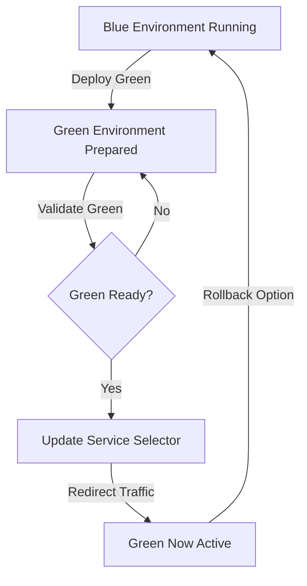

# Blue-Green Deployment Project

## Prerequisites
- Docker Desktop
- Minikube
- kubectl
- Helm
- Node.js
- Git

## Project Setup

### 1. Clone the Repository
```bash
git clone <your-repository-url>
cd blue-green-project
```

### 2. Local Development

#### Backend Setup
1. Navigate to backend directory
2. Install dependencies
```bash
cd backend
npm install
```
3. Create `.env` file with:
```
PORT=5000
MONGO_URI=your-mongodb-connection-string
```
4. Start backend server
```bash
npm start
```

#### Frontend Setup
1. Setup Blue Frontend
```bash
cd frontend-blue
npm install
```
2. Create `.env` file:
```
PORT=3100
```
3. Start blue frontend
```bash
npm start
```

3. Repeat similar steps for Green Frontend (with PORT=3200)

### 3. Dockerization

#### Build Docker Images
```bash
# Build Backend Image
docker build -t your-username/backend:v1 ./backend

# Build Blue Frontend Image
docker build -t your-username/frontend-blue:v1 ./frontend-blue

# Build Green Frontend Image
docker build -t your-username/frontend-green:v1 ./frontend-green
```

### 4. Kubernetes Deployment

#### Minikube Setup
1. Start Minikube
```bash
minikube start
```

2. Enable Required Addons
```bash
minikube addons enable metrics-server
minikube addons enable ingress
```

### 5. Create Kubernetes Manifest Files

#### Required Manifest Files
Create following files in `k8s/` directory:
- `backend-deployment.yaml`
- `frontend-blue-deployment.yaml`
- `frontend-green-deployment.yaml`
- `frontend-service.yaml`
- `ingress.yaml`

#### Service File Key Concepts
Your `frontend-service.yaml` should:
- Use selector to route traffic
- Define version (blue/green)
- Map ports correctly

### 6. Deploy to Minikube
```bash
# Apply all manifests
kubectl apply -f k8s/

# Verify deployments
kubectl get deployments
kubectl get services
kubectl get pods
```

### 7. Blue-Green Switching

#### Switch Traffic Methods

1. Basic Patch Command
```bash
# Switch to Green
kubectl patch service frontend-service -p '{"spec":{"selector":{"version":"green"}}}'

# Switch back to Blue
kubectl patch service frontend-service -p '{"spec":{"selector":{"version":"blue"}}}'
```

2. Detailed Patch Command
```bash
kubectl patch service frontend-service --type='merge' -p '{
  "spec":{
    "selector":{
      "app":"frontend",
      "version":"green"
    }
  }
}'
```

### 8. Verification
- Check service endpoints
- Verify traffic routing
- Monitor application logs

### Troubleshooting
- `kubectl get pods` - Check pod status
- `kubectl logs <pod-name>` - View logs
- `kubectl describe service frontend-service` - Service details

### Cleanup
```bash
# Remove deployments
kubectl delete -f k8s/

# Stop Minikube
minikube stop
```

## Blue-Green Deployment Flow Chart



### Flow Explanation
1. Blue environment is initial production
2. Green environment deployed alongside
3. Validate green environment 
4. Update service selector
5. Redirect traffic to green
6. Blue remains as rollback option

## Best Practices
- Implement health checks
- Use resource limits
- Configure monitoring
- Validate before switching
- Maintain rollback strategy


## License
This project is licensed under the MIT License


Deployment Evidence:

Project Structure (Clean & Production-Friendly)

To build docker images using docker compose: 
```
docker-compose build
```


Apply kuberbetes files 
```
kubectl apply -f .\k8s\.
```


To test the application from your local device use port-forward
Backend service: 
```
kubectl port-forward svc/backend-service 5000:5000
```


Open the browser and type: 
```
http://localhost:5000/health
```


Frontend service:
```
kubectl port-forward svc/frontend-service 8080:80
```


To get the current version selector: 
```
kubectl describe service frontend-service
```


To check if frontend is running on Blue services: 
```
http://localhost:8080/health
```


Switch the services to green:
```
kubectl patch service frontend-service -p '{"spec":{"selector":{"version":"green"}}}'
```


Note: we have to stop the port-forwarding for frontend and re do it, however inside the node it works fine
```
kubectl port-forward svc/frontend-service 8080:80
```


Now test the health of frontend it should show Frontend services are running from Green application
```
http://localhost:8080/health
```


To clean up 


